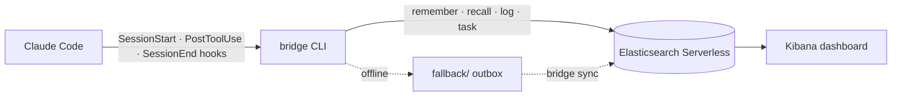

<div class="absolute inset-0 flex flex-col justify-center items-start px-20">
  <h1 class="!text-[5.5rem] !leading-[1.02] !font-semibold !tracking-tight !mb-6 !max-w-[95%]">
    Give Your Coding Agent an <span class="text-[var(--p-primary)]">(Elastic)</span> Memory
  </h1>
  <p class="!mt-1 !text-[2.4rem] text-[var(--p-fg-muted)] !m-0 !leading-relaxed !max-w-[90%]">
    Decisions and session history that survive the context window.
  </p>
  <p class="!mt-10 !text-[1.8rem] text-[var(--p-fg-muted)] !m-0 !leading-relaxed">
    Engin Diri · Principal Solutions Architect, Pulumi<br/>
    Elastic NYC User Group × Pulumi · October 6, 2026
  </p>
</div>

<!--
DRAFT. 30s. Read the title. The "(Elastic)" is the pun and the promise:
elastic as in stretchy, Elastic as in the room we're standing in.
-->

---
class: soul-slide
---

# SOUL.md

<div class="h-[50px]"></div>

<<< @/snippets/soul.md md

<!--
DRAFT. 20s. Same intro as the GPU talk: I introduce myself the way an agent
does. It lands even harder here, because tonight's topic is literally what
an agent remembers about itself.
-->

---

<div class="absolute inset-0 flex flex-col justify-center items-center px-20 text-center">
  <h1 class="!text-[7rem] !leading-tight !font-semibold !tracking-tight !m-0 !max-w-[95%]">
    Your coding agent has <span class="text-[var(--p-primary)]">amnesia.</span>
  </h1>
</div>

<!--
DRAFT. 10s. Let it land. Everybody in the room has re-explained the same
convention to Claude or Copilot three sessions in a row.
-->

---
class: 'meme-slide'
---

<div class="meme-frame">
  <!-- TODO: pick the meme (Dory, Memento tattoos, 50 First Dates) and drop it in public/ -->
  <p class="!text-[2rem] text-[var(--p-fg-muted)]">meme goes here</p>
</div>

<!--
DRAFT. ~5s. No words. Wait for the laugh.
-->

---

# What your agent remembers today.

<div class="grid grid-cols-2 gap-10 mt-4">

<div v-click class="mem-card mem-card--muted">
<div class="mem-caption mem-caption--muted">The context window</div>
<p class="!mt-4 !text-[1.2rem] !leading-snug">
Everything the session has seen. Gone when the session ends, compacted when it gets long.
</p>
</div>

<div v-click class="mem-card mem-card--muted">
<div class="mem-caption mem-caption--muted">CLAUDE.md + auto-memory</div>
<p class="!mt-4 !text-[1.2rem] !leading-snug">
Markdown files in <code>~/.claude/projects/&lt;project&gt;/memory/</code>. One machine, one project, loaded by filename.
</p>
</div>

</div>

<p v-click class="!mt-10 !text-[2.3rem] !leading-relaxed text-[var(--p-primary)] !font-semibold text-center">
Nothing is searchable. Nothing is shared.
</p>

<!--
DRAFT. 60s. Walk both cards. The auto-memory index is loaded into every
session, so it has to stay small. New laptop, new sandbox, new teammate:
start from zero.
-->

---

<div class="absolute inset-0 flex flex-col justify-center items-center px-20 text-center">
  <h1 class="!text-[7rem] !leading-tight !font-semibold !tracking-tight !m-0 !max-w-[95%]">
    Memory is a <span class="text-[var(--p-primary)]">search problem.</span>
  </h1>
</div>

<!--
DRAFT. 10s. And we're standing in the office of the company that does search.
-->

---
layout: diagram
---

# agent-memory, by Jeff Vestal.



<!--
DRAFT. 60s. Credit Jeff (Elastic). Pure bash: curl + jq. Seven indices:
memory, messages, sessions, tasks, status, entities, entity history.
Offline writes queue locally.
Source: github.com/jeffvestal/agent-memory
-->

---

# Recall is one ES|QL query.

<div class="big-code !mt-6">

```sql
FROM agent-memory METADATA _id, _score, _index
| FORK
    ( WHERE content:"why HCL?" OR title:"why HCL?"   | SORT _score DESC | LIMIT 50 )
    ( WHERE content_semantic:"why HCL?"              | SORT _score DESC | LIMIT 50 )
| FUSE
| EVAL final_score = _score * DECAY(created_at, NOW(), "45d")
| SORT final_score DESC | LIMIT 5
```

</div>

<p v-click class="!mt-8 !text-[1.6rem] !leading-relaxed text-center text-[var(--p-fg-muted)]">
BM25 and Jina v5 embeddings, fused, and older memories fade.
</p>

<!--
DRAFT. 60s. FORK runs keyword and semantic branches, FUSE merges them with
reciprocal rank fusion, DECAY makes last week's decision beat last quarter's.
Trimmed from lib/memory.sh (scope filters omitted).
-->

---

<div class="absolute inset-0 flex flex-col justify-center items-center px-20 text-center">
  <h1 class="!text-[6rem] !leading-tight !font-semibold !tracking-tight !m-0 !max-w-[95%]">
    Great. Now make it <span class="text-[var(--p-primary)]">infrastructure.</span>
  </h1>
</div>

<!--
DRAFT. 10s. The upstream repo sets up the cluster with a 300-line install.sh
and curl. Pivot to Pulumi.
-->

---

# Yes, that's HCL. Yes, that's Pulumi.

<div class="big-code !mt-4">

<<< @/snippets/infra/main.tf hcl

</div>

<!--
DRAFT. 60s. runtime: hcl in Pulumi.yaml. elastic/ec and elastic/elasticstack
are Terraform providers, pulled from the OpenTofu registry and bridged on
the fly. The second provider is configured from the first resource's outputs.
Source: pulumi.com/docs/iac/languages-sdks/hcl
-->

---

# Seven indices, one scoped key.

<div class="big-code !mt-4">

```hcl
resource "elasticstack_elasticsearch_index" "memory" {
  for_each = local.indices

  name                = each.key
  mappings            = jsonencode({ properties = each.value })
  deletion_protection = false
}

resource "elasticstack_elasticsearch_security_api_key" "bridge" {
  name = "agent-memory-${var.agent_id}"
  role_descriptors = jsonencode({
    agent_memory = {
      cluster = ["monitor", "monitor_inference"]
      indices = [{ names = keys(local.indices), privileges = ["all"] }]
    }
  })
}
```

</div>

<!--
DRAFT. 45s. semantic_text fields point at Jina v5 on the Elastic Inference
Service, no model to deploy. The bridge gets a key for these indices only;
the admin credentials never leave the stack. Trimmed from infra/memory.tf.
-->

---

# The dashboard is still just JSON.

<div class="big-code !mt-4">

<<< @/snippets/infra/dashboard.tf hcl

</div>

<!--
DRAFT. 30s. The repo's dashboard export stays the source of truth; HCL for
expressions turn it into the provider's panel list.
-->

---

# Any Terraform provider. Almost.

<div class="big-code !mt-6">

```text
$ pulumi install
error: elasticstack_elasticsearch_query_ruleset: required property "_id"
  starts with an underscore and cannot be generated
```

</div>

<p v-click class="!mt-8 !text-[1.6rem] !leading-relaxed text-center">
Pinned <code>elastic/elasticstack</code> to <code>0.16.0</code>. One line, moved on.
</p>

<!--
DRAFT. 30s. Honest slide. 0.16.1 added a resource whose output field starts
with an underscore; the dynamic bridge can't name it yet. TODO: link the
upstream issue once filed.
-->

---

<div class="absolute inset-0 flex flex-col justify-center items-center px-20 text-center">
  <h1 class="!text-[6rem] !leading-tight !font-semibold !tracking-tight !m-0 !max-w-[95%]">
    Where does the agent <span class="text-[var(--p-primary)]">run?</span>
  </h1>
</div>

<!--
DRAFT. 10s. Memory with an API key next to an agent with shell access. Don't
hand it the Elastic Cloud key.
-->

---

# Docker Sandboxes: the key never enters the box.

<div class="big-code !mt-4">

```yaml
credentials:
  - service: elastic-cloud
    apiKey:
      name: EC_API_KEY
      proxyManaged: true          # the container sees "proxy-managed"
      inject:
        - domain: api.elastic-cloud.com
          header: Authorization
          format: "ApiKey %s"     # the proxy writes the real key
```

</div>

<!--
DRAFT. 60s. From kit/spec.yaml. `sbx secret set -g elastic-cloud` on the
host; inside the sandbox `pulumi up` works, `echo $EC_API_KEY` prints a
placeholder. The kit also allow-lists *.es.<region>.elastic.cloud and runs
the startup wiring.
Source: docs.docker.com/ai/sandboxes/customize/kit-reference
-->

---

# Hooks are a package now.

<div class="big-code !mt-6">

```bash
apm install dirien/agent-memory
```

</div>

<p v-click class="!mt-8 !text-[1.6rem] !leading-relaxed text-center">
SessionStart syncs, PostToolUse indexes, SessionEnd logs. Plus a skill that says <em>recall before you re-derive</em>.
</p>

<!--
DRAFT. 45s. Microsoft APM merges .apm/hooks/agent-memory.json into
.claude/settings.json and deploys the skill. No more copying JSON into
settings by hand.
-->

---

<div class="absolute inset-0 flex flex-col justify-center items-center px-20 text-center">
  <h1 class="!text-[10rem] !leading-tight !font-semibold !tracking-tight !m-0 text-[var(--p-primary)] !max-w-[95%]">Demo.</h1>
</div>

<!--
DRAFT. TODO: script once the demo runs end to end.
1. pulumi up (pre-created project; show the preview)
2. scripts/write-env.sh && bridge status
3. Sandbox A: decide something, `bridge remember`
4. Sandbox B (fresh): ask about it, the agent recalls
5. Kibana dashboard
-->

---

# The memory had amnesia.

<div class="big-code !mt-6">

```bash
content="$(echo "$content" | sed '1,/^---$/d' | sed '1,/^---$/d')"
#                                                ^ deletes the body too
```

</div>

<p v-click class="!mt-8 !text-[1.6rem] !leading-relaxed text-center">
Every synced memory reached Elasticsearch with an empty body. Fixed in the fork.
</p>

<!--
DRAFT. 45s. Found while porting to Linux for the sandbox. The second sed
pass ate everything after the frontmatter. Also: every memory typed
"observation", because Claude Code now nests `type:` under `metadata:`.
-->

---

<div class="absolute inset-0 flex flex-col justify-center items-center px-20 text-center">
  <h1 class="!text-[5.5rem] !leading-tight !font-semibold !tracking-tight !m-0 !max-w-[95%]">
    Memory is infrastructure.<br/>
    <span class="text-[var(--p-primary)]">Treat it like infrastructure.</span>
  </h1>
</div>

<!--
DRAFT. 10s. Takeaway. Versioned, reviewed, reproducible, with scoped
credentials.
-->

---

<div class="absolute inset-0 flex flex-col justify-center items-center px-20 text-center">
  <h1 class="!text-[10rem] !leading-tight !font-semibold !tracking-tight !m-0 text-[var(--p-primary)] !max-w-[95%]">Q&amp;A</h1>
</div>

---

<div class="absolute inset-0 flex flex-col justify-center items-center px-20 text-center">
  <h1 class="!text-[10rem] !leading-tight !font-semibold !tracking-tight !m-0 text-[var(--p-primary)] !max-w-[95%]">Thanks.</h1>
</div>

---

# Resources

<div class="contact-grid">
  <div class="contact-card">
    <div class="contact-card__avatar">
      
    </div>
    <div class="contact-card__name">Engin Diri</div>
    <div class="contact-card__role">Pulumi</div>
    <div class="contact-card__qr">
      
    </div>
  </div>

  <div class="contact-card">
    <div class="contact-card__name">Slides + Demo</div>
    <div class="contact-card__role contact-card__role--mono">github.com/dirien/agent-memory</div>
    <div class="contact-card__qr">
      
    </div>
  </div>
</div>

<style scoped>
.contact-grid {
  display: grid;
  grid-template-columns: auto auto;
  justify-content: center;
  gap: 6rem;
  margin-top: 2.5rem;
  align-items: start;
}
.contact-card {
  display: flex;
  flex-direction: column;
  align-items: center;
  text-align: center;
  gap: 0.6rem;
}
.contact-card__avatar {
  width: 9rem;
  height: 9rem;
  border-radius: 9999px;
  overflow: hidden;
  border: 2px solid var(--p-primary);
}
.contact-card__avatar img { width: 100%; height: 100%; object-fit: cover; }
.contact-card__name { font-size: 1.7rem; font-weight: 700; margin-top: 0.5rem; color: var(--p-fg); }
.contact-card__role { font-size: 1.15rem; color: var(--p-fg-muted); }
.contact-card__role--mono { font-family: var(--slidev-font-mono); font-size: 0.95rem; }
.contact-card__qr {
  margin-top: 1rem;
  background: white;
  padding: 0.6rem;
  border-radius: 0.5rem;
  width: 11rem;
  height: 11rem;
}
.contact-card__qr img { width: 100%; height: 100%; object-fit: contain; }
</style>

<!--
Closing slide. The QR codes come from api.qrserver.com at render time; if
the venue WiFi is bad, pre-render PNGs into public/.
-->
