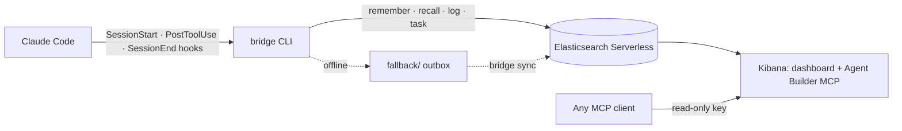

<div class="absolute inset-0 flex flex-col justify-center items-start px-20">
  <h1 class="!text-[5.5rem] !leading-[1.02] !font-semibold !tracking-tight !mb-6 !max-w-[95%]">
    Give Your Coding Agent an <span class="text-[var(--p-primary)]">(Elastic)</span> Memory
  </h1>
  <p class="!mt-1 !text-[2.4rem] text-[var(--p-fg-muted)] !m-0 !leading-relaxed !max-w-[90%]">
    Decisions and session history that survive the context window.
  </p>
  <p class="!mt-10 !text-[1.8rem] text-[var(--p-fg-muted)] !m-0 !leading-relaxed">
    Engin Diri · Principal Solutions Architect, Pulumi<br/>
    Elastic NYC User Group × Pulumi · October 6, 2026
  </p>
</div>

<!--
~20s. Read the title. "(Elastic)" is the pun: stretchy memory, and the
company whose office we're in.
-->

---
class: soul-slide
---

# SOUL.md

<div class="h-[50px]"></div>

<<< @/snippets/soul.md md

<!--
~20s. Same intro as the GPU talk: I introduce myself the way an agent does.
Tonight's topic is what an agent remembers about itself, so it fits.
-->

---

<div class="term-grid !mt-2">
<div>
<div class="mem-caption">Friday, 5:40 PM</div>

```text
> The venue WiFi is unreliable, so every live demo
  step needs a pre-recorded fallback video.
  Also track a task: pre-render the QR codes on the
  Resources slide as PNGs. I'll do it later.

● Got it. Fallback videos for every demo step, and
  the QR task stays open for a later session.
```

</div>
<div v-click>
<div class="mem-caption mem-caption--accent">Monday, 9:05 AM</div>

```text
> regarding my prep for the talk, how was the wifi?

● I don't have any context about WiFi from a
  previous session. Could you tell me more about
  what you're preparing?
```

</div>
</div>

<!--
~60s. Tell it as a story, first person. "On Friday I was preparing this talk
with Claude. I told it two things." Read the Friday prompt. "It said: got it."
Pause. Click. "Monday morning, new session." Read the question, then the
answer. Wait for the laugh of recognition.

Dramatized: the Friday prompt is the one from DEMO.md; the replies are
reconstructed. TODO: replace both with real screenshots from a sandbox
without the agent-memory kit.
[TK: or swap in a real moment where Claude forgot something that cost you.]
-->

---

<div class="absolute inset-0 flex flex-col justify-center items-center px-20 text-center">
  <h1 class="!text-[7rem] !leading-tight !font-semibold !tracking-tight !m-0 !max-w-[95%]">
    Your coding agent has <span class="text-[var(--p-primary)]">amnesia.</span>
  </h1>
</div>

<!--
~10s. Let it land. Everyone here has explained the same convention to their
agent three sessions in a row.
-->

---
class: 'meme-slide'
---

<div class="meme-frame memento">
  <div class="memento__scene">
    
    <div class="memento__photo">&gt; claude</div>
    <div class="memento__caption">WiFi is bad.<br/>Record every demo.</div>
  </div>
</div>

<!--
~10s. Memento. Leonard can't form new memories, so he runs on Polaroids
with notes on them. Say nothing and wait for the laugh, or: "Leonard, but
for your agent." This is Friday's first note.
Optional line: Karpathy, May 2025: "LLMs are quite literally like the guy in
Memento, except we haven't given them their scratchpad yet."
Sources: x.com/karpathy/status/1921368644069765486 (read via the fxtwitter
mirror; x.com returned 402). Still: Memento (2000), via srcdn.com; caption
font Permanent Marker (Apache 2.0), public/fonts/.
-->

---
class: 'meme-slide'
---

<div class="meme-frame memento">
  <div class="memento__scene">
    
    <div class="memento__photo">MEMORY.md</div>
    <div class="memento__caption">QR codes:<br/>still open.</div>
  </div>
</div>

<!--
~5s. Second Polaroid: the open task. No words needed.
-->

---
class: 'meme-slide'
---

<div class="meme-frame memento">
  <div class="memento__scene">
    
    <div class="memento__photo">/compact</div>
    <div class="memento__caption">Don't trust<br/>the summary.</div>
  </div>
</div>

<!--
~5s. Third Polaroid, and the bridge to the next slide: "Don't trust the
summary" is exactly where fix one breaks.
-->

---

# Fix one: never close the session.

<div class="stat">53%</div>

<p class="stat-caption">
of safety instructions survived one round of compaction, even though the prompt asked to keep them all.
</p>

<p class="stat-source">University of Passau, arXiv:2608.22752</p>

<p v-click class="takeaway">/compact decides what your agent forgets. It doesn't ask you.</p>

<!--
~50s. Hand-raise: "Who has a session open right now that they're afraid to
close?" The first fix everyone tries is to keep the session alive. Long
sessions get compacted, and the summary keeps what the summary keeps.
After five rounds, each halving the text, 10% of the safety instructions
were left.
Fact-check: both figures as quoted in my "10 tips" post (2026-09-21), which
cites arXiv:2608.22752. https://www.pulumi.com/blog/10-tips-to-improve-your-coding-agent-game/
-->

---

# Fix two: write it down yourself.

<div class="stat">73.8%</div>

<p class="stat-caption">
of AI configuration files in 441 repositories were committed once and never touched again.
</p>

<p class="stat-source">Denisov-Blanch et al., arXiv:2608.25241</p>

<p v-click class="takeaway">Every lesson needs a human to write it down, and to keep it true.</p>

<!--
~50s. Hand-raise: "Who has a CLAUDE.md or an AGENTS.md? Who changed it this
month?" The second fix: write the rules down. It works, and I still do it
(one screen, layered, a Stop hook that proposes updates; my May post). But
the file only knows what someone typed into it, and it goes stale.
Fact-check: 73.8% and 441 repositories as quoted in my "10 tips" post
(2026-09-21), citing arXiv:2608.25241.
-->

---

# Fix three: let the agent write it down.

<div class="code-xl !mt-2">

```text
~/.claude/projects/<project>/memory/
├── MEMORY.md        # index: first 200 lines or 25 KB load every session
├── user-role.md
└── feedback-tests.md
```

</div>

<div v-click class="quote-card !mt-8">
<p>"Files are not shared across machines or cloud environments."</p>
<p class="quote-by">Claude Code docs, auto memory</p>
</div>

<p v-click class="takeaway">New laptop, new sandbox, new teammate: back to zero.</p>

<!--
~50s. Claude Code's auto memory: the agent writes its own notes and an index,
and the index loads into every session. This is a real step up. It's also
the reason Friday's sandbox knew and Monday's didn't: Monday was a new
container with a new home directory.
Fact-check: "The first 200 lines of MEMORY.md, or the first 25KB, whichever
comes first, are loaded at the start of every conversation." "Auto memory is
machine-local ... Files are not shared across machines or cloud
environments." https://code.claude.com/docs/en/memory
The two topic file names are illustrative.
-->

---

<div class="absolute inset-0 flex flex-col justify-center items-center px-20 text-center">
  <h1 class="!text-[7rem] !leading-tight !font-semibold !tracking-tight !m-0 !max-w-[95%]">
    Second <span class="text-[var(--p-primary)]">brain!</span>
  </h1>
</div>

<!--
~5s. Section break. "Before we gave agents memory, we built it for
ourselves."
-->

---

# People have always kept a second brain.

<div class="timeline !mt-4">
<div v-click class="mem-card">
<div class="year">1945</div>
<p>Vannevar Bush's Memex: "an enlarged intimate supplement to his memory."</p>
</div>
<div v-click class="mem-card">
<div class="year">1952</div>
<p>Niklas Luhmann starts a slip box that grows to about 90,000 cards.</p>
</div>
<div v-click class="mem-card">
<div class="year">2022</div>
<p>Tiago Forte's <em>Building a Second Brain</em>.</p>
</div>
<div v-click class="mem-card mem-card--primary">
<div class="year">2026</div>
<p>Karpathy's LLM Wiki: the model keeps the notes.</p>
</div>
</div>

<div v-click class="quote-card !mt-10">
<p>"Humans abandon wikis because the maintenance burden grows faster than the value."</p>
<p class="quote-by">Andrej Karpathy, LLM Wiki gist, April 2026</p>
</div>

<!--
~60s. Hand-raise: "Who has an Obsidian vault? Who still keeps it up?"
We've built external memory for ourselves for a long time. Most personal
systems die the same way: nobody does the upkeep. Click through the four.
Fact-check:
- Bush, "As We May Think", The Atlantic, July 1945. Quote from the W3C
  mirror https://www.w3.org/History/1945/vbush/vbush6.shtml (The Atlantic
  blocked the fetch; check it there before the talk).
- Luhmann: Bielefeld University, a good 90,000 items; box 1 c. 1952-1962.
- Forte: first published June 14, 2022 (Atria).
- Karpathy gist created 2026-04-04:
  https://gist.github.com/karpathy/442a6bf555914893e9891c11519de94f
-->

---

# The LLM does the upkeep now.

<div class="grid grid-cols-2 gap-10 !mt-2 items-center">
<div class="code-lg">

```text
raw/            sources you drop in
wiki/
├── index.md    one line per page
├── log.md      what changed, and when
└── *.md        pages the LLM writes and links
CLAUDE.md       the schema: how to keep the wiki
```

</div>
<div class="quote-card">
<p>"The part he couldn't solve was who does the maintenance. The LLM handles that."</p>
<p class="quote-by">Karpathy, on the Memex, LLM Wiki gist</p>
</div>
</div>

<p v-click class="takeaway">Knowledge as code: the agent writes it, git keeps it, a pull request reviews it.</p>

<!--
~50s. Karpathy's gist: three layers (raw sources, the wiki, a schema file
such as CLAUDE.md or AGENTS.md) and three operations (ingest, query, lint).
The index file works "surprisingly well at moderate scale (~100 sources,
~hundreds of pages)". In July I wrote about putting that wiki in git in a
format another agent can read (Google's Open Knowledge Format).
Fact-check: gist text; my post "Knowledge as Code: The Memory File Just Got
a Spec" (2026-07-14): https://www.pulumi.com/blog/knowledge-as-code-the-memory-file-just-got-a-spec/
-->

---

# Where the wiki stops.

<div class="grid grid-cols-2 gap-10 !mt-4">
<div class="quote-card">
<p>"At small scale the index file is enough, but as the wiki grows you want proper search."</p>
<p class="quote-by">Karpathy, LLM Wiki gist</p>
</div>
<div v-click class="quote-card">
<p>"A knowledge base you can't hand to someone else's agent is a silo of one."</p>
<p class="quote-by">Engin Diri, "Knowledge as Code", pulumi.com/blog, July 2026</p>
</div>
</div>

<!--
~40s. Two limits, in the authors' own words. The wiki gets too big to load
or grep, and it stays on one person's disk in one person's dialect.
Karpathy's gist goes on to recommend a local engine with hybrid BM25/vector
search. Hold that thought.
Fact-check: gist; my July post (above).
-->

---

<div class="absolute inset-0 flex flex-col justify-center items-center px-20 text-center">
  <h1 class="!text-[7rem] !leading-tight !font-semibold !tracking-tight !m-0 !max-w-[95%]">
    Memory is a <span class="text-[var(--p-primary)]">search problem.</span>
  </h1>
</div>

<!--
~15s. And we're standing in the office of the company that does search.
-->

---

# Where each memory lives.

<table class="cmp !mt-2">
<thead>
<tr><th></th><th>CLAUDE.md</th><th>Auto memory</th><th>LLM wiki</th><th class="cmp-es">Elasticsearch</th></tr>
</thead>
<tbody>
<tr><td>Who writes it</td><td>you</td><td>the agent</td><td>the agent</td><td class="cmp-es">the agent, via hooks and CLI</td></tr>
<tr><td>New laptop or sandbox</td><td>in git</td><td>starts empty</td><td>in git</td><td class="cmp-es">same index</td></tr>
<tr><td>Your teammate's agent</td><td>via git</td><td>never sees it</td><td>via git, in your format</td><td class="cmp-es">same index, or over MCP</td></tr>
<tr><td>How it's found</td><td>loaded every session</td><td>first 200 lines loaded</td><td>index.md, then grep</td><td class="cmp-es">hybrid search, top 5</td></tr>
<tr><td>As it grows</td><td>eats context</td><td>gets truncated</td><td>needs real search</td><td class="cmp-es">ranked; older memories fade</td></tr>
</tbody>
</table>

<!--
~75s. The whole talk so far on one slide. Walk the rows, not the columns:
"New laptop? Teammate? How does the agent find it? What happens as it
grows?" Each Markdown approach gives up at least one row. The Elasticsearch
column is what the rest of the talk shows.
Fact-check:
- CLAUDE.md: "Longer files consume more context and reduce adherence."
  https://code.claude.com/docs/en/memory
- Auto memory: 200 lines / 25 KB of MEMORY.md; machine-local (same page).
- LLM wiki: Karpathy gist, "as the wiki grows you want proper search".
- Elasticsearch: lib/memory.sh (recall default --limit 5, FORK/FUSE/DECAY);
  infra/mcp.tf (read-only MCP key).
-->

---
layout: diagram
---

# agent-memory, by Jeff Vestal.



<!--
~50s. Credit Jeff (Elastic) up front: this is his project, I extended it.
Pure bash, curl and jq. Seven indices: memory, messages, sessions, tasks,
status, entities, entity history. Offline writes queue locally and sync
later. I added the Pulumi program, the sandbox kit and the MCP path.
Sources: github.com/jeffvestal/agent-memory; Jeff's Elasticsearch Labs post
(2026-06-15).
-->

---

# Recall is one ES|QL query.

<div class="big-code !mt-6">

```sql
FROM agent-memory METADATA _id, _score, _index
| FORK
    ( WHERE content:"how was the wifi?" OR title:"how was the wifi?" | SORT _score DESC | LIMIT 50 )
    ( WHERE content_semantic:"how was the wifi?"                    | SORT _score DESC | LIMIT 50 )
| FUSE
| EVAL final_score = _score * DECAY(created_at, NOW(), 1080 hours)
| SORT final_score DESC | LIMIT 5
```

</div>

<p v-click class="!mt-8 !text-[1.6rem] !leading-relaxed text-center text-[var(--p-fg-muted)]">
BM25 and Jina v5 embeddings side by side, fused, and older memories pushed down.
</p>

<!--
~60s. Monday's question, as the query recall runs. FORK runs the keyword
branch and the semantic branch, FUSE merges them with reciprocal rank
fusion, DECAY multiplies the score down by age. 1080 hours is the default
45-day window: ES|QL's DECAY rejects "45d", so the bridge converts it.
Fact-check: trimmed from lib/memory.sh (scope and type filters omitted);
_esql_decay_duration converts BRIDGE_MEMORY_DECAY_WINDOW.
TODO before saying "forgetting curve": check DECAY's default function
(linear vs exp) in the Elasticsearch docs.
-->

---

# Why Elasticsearch.

<div class="why-grid !mt-2">
<div v-click class="mem-card">
<div class="mem-caption mem-caption--accent">Shared</div>
<p>One index for every laptop, sandbox, teammate and agent, over the CLI or MCP.</p>
<p class="why-benefit">Monday's fresh sandbox knows what Friday decided.</p>
</div>
<div v-click class="mem-card">
<div class="mem-caption mem-caption--accent">Searched, not loaded</div>
<p>Recall puts the five best matches into context, not a whole file.</p>
<p class="why-benefit">Memory can grow without growing every prompt.</p>
</div>
<div v-click class="mem-card">
<div class="mem-caption mem-caption--accent">Hybrid</div>
<p>BM25 matches the exact task ID. Embeddings match "how was the wifi?" to "the venue WiFi is unreliable".</p>
<p class="why-benefit">Exact terms and paraphrases both find it.</p>
</div>
<div v-click class="mem-card">
<div class="mem-caption mem-caption--accent">Time-aware</div>
<p>Every memory has a timestamp, and DECAY scales its score by age.</p>
<p class="why-benefit">Last week's decision outranks last quarter's.</p>
</div>
<div v-click class="mem-card">
<div class="mem-caption mem-caption--accent">Queryable</div>
<p>Memories, tasks and sessions are indices. ES|QL and Kibana work on them as they are.</p>
<p class="why-benefit">You can see what your agents remembered and did.</p>
</div>
<div v-click class="mem-card">
<div class="mem-caption mem-caption--accent">Scoped</div>
<p>The bridge key can write seven indices. The MCP key can only read them.</p>
<p class="why-benefit">Any agent can read the team's memory. Not every agent can rewrite it.</p>
</div>
</div>

<!--
~90s. The reason, then the benefit, six times. Spend the time on the first
three; they answer the three rows the Markdown approaches gave up.
If someone asks "why not mem0, Letta or Zep?": they're good, and most of
them ended up doing hybrid search too. If your team already runs
Elasticsearch, this is seven more indices, not another vendor.
Fact-check: lib/memory.sh (limit 5, FORK/FUSE/DECAY); infra/memory.tf
(bridge key: "all" on the seven indices); infra/mcp.tf (MCP key: "read",
"view_index_metadata"); a write with the MCP key gets 403 (DEMO.md).
-->

---

# When you don't need this.

<div class="grid grid-cols-2 gap-10 !mt-2">
<div class="mem-card mem-card--muted">
<div class="mem-caption">Stay with Markdown when</div>
<p class="!mt-4">One developer, one machine, one repo.</p>
<p>The memory fits in an index file. Karpathy puts that at hundreds of pages.</p>
</div>
<div class="mem-card mem-card--primary">
<div class="mem-caption mem-caption--accent">Reach for Elasticsearch when</div>
<p class="!mt-4">Memory has to cross machines, sandboxes, agents or people.</p>
<p>It outgrows what you can load or grep, or you want to see what your agents did.</p>
</div>
</div>

<p v-click class="takeaway text-center">The price: a cluster to run, a network call per recall, and a key your agent must never see.</p>

<!--
~40s. Be honest here; it buys trust for the rest. A solo developer on one
laptop doesn't need a cluster. The last line sets up the next section: who
runs it, and how the agent gets access without holding the key.
Fact-check: Karpathy gist, index.md "works surprisingly well at moderate
scale (~100 sources, ~hundreds of pages)".
-->

---

<div class="absolute inset-0 flex flex-col justify-center items-center px-20 text-center">
  <h1 class="!text-[6rem] !leading-tight !font-semibold !tracking-tight !m-0 !max-w-[95%]">
    Great. Now make it <span class="text-[var(--p-primary)]">infrastructure.</span>
  </h1>
</div>

<!--
~10s. Upstream sets up the cluster with a 299-line install.sh and curl.
Pivot to Pulumi.
-->

---

# Yes, that's HCL. Yes, that's Pulumi.

<div class="hcl-grid !mt-2">
<div>

```yaml
# Pulumi.yaml (trimmed)
name: agent-memory-infra
runtime: hcl
```

<<< @/snippets/infra/main.tf#project hcl

</div>
<div>

<<< @/snippets/infra/main.tf#provider hcl

</div>
</div>

<!--
~50s. runtime: hcl in Pulumi.yaml. elastic/ec and elastic/elasticstack are
Terraform providers, pulled from the OpenTofu registry and bridged on the
fly. The second provider is configured from the first resource's outputs:
the admin credentials never leave the stack. 16 resources in total.
Sources: pulumi.com/docs/iac/languages-sdks/hcl; infra/main.tf (regions
"project" and "provider"); infra/Pulumi.yaml (trimmed).
-->

---

# Seven indices, two scoped keys.

<div class="big-code !mt-4">

```hcl
resource "elasticstack_elasticsearch_index" "memory" {
  for_each = local.indices
  name     = each.key
  mappings = jsonencode({ properties = each.value })
}

resource "elasticstack_elasticsearch_security_api_key" "bridge" {   # hooks + CLI
  role_descriptors = jsonencode({ agent_memory = {
    indices = [{ names = keys(local.indices), privileges = ["all"] }]
  } })
}

resource "elasticstack_elasticsearch_security_api_key" "mcp" {      # any MCP client
  role_descriptors = jsonencode({ agent_memory_mcp = {
    indices = [{ names = keys(local.indices), privileges = ["read", "view_index_metadata"] }]
  } })
}
```

</div>

<!--
~40s. semantic_text fields point at Jina v5 on the Elastic Inference
Service, so there's no model to deploy. Two keys: the bridge writes, the MCP
server only reads. That's the "Scoped" card from before, in code.
Fact-check: trimmed from infra/memory.tf and infra/mcp.tf (cluster
privileges, Kibana application privileges and metadata omitted).
-->

---

<div class="absolute inset-0 flex flex-col justify-center items-center px-20 text-center">
  <h1 class="!text-[6rem] !leading-tight !font-semibold !tracking-tight !m-0 !max-w-[95%]">
    Where does the agent <span class="text-[var(--p-primary)]">run?</span>
  </h1>
</div>

<!--
~10s. We just put a memory API key next to an agent with shell access. Don't
hand it the key.
-->

---

# Docker Sandboxes: the key never enters the box.

<div class="big-code !mt-4">

```bash
# on the host: the real key stays in Pulumi ESC
sbx secret set-custom --host '*.es.us-east-1.aws.elastic.cloud' \
  --env BRIDGE_ES_API_KEY \
  --command "pulumi env get $E elastic.bridgeApiKey --value string --show-secrets"

# in the sandbox
$ echo $BRIDGE_ES_API_KEY
<placeholder>     # swapped for the real key on *.es.…elastic.cloud only
```

</div>

<p v-click class="!mt-8 !text-[1.6rem] !leading-relaxed text-center">
Any other host gets the placeholder. The first time Claude saw it, it reported a leaked credential.
</p>

<!--
~50s. The sandbox gets a placeholder in the variable; the proxy replaces it
in request headers, only for hosts matching the pattern, by running the
pulumi env get command on the host. Rotate the key in Pulumi and nothing in
the sandbox changes. Laugh line: Claude flagged the placeholder as a live
credential, so the SessionStart hook now tells it what it is.
Fact-check: kit/README.md "Why placeholders" (verified 2026-09-27: other
ApiKey values got 401; survived a key rotation); DEMO.md (command trimmed,
`| tr -d '\n'` omitted); hooks/session-start.sh; commit 76515b9.
Never show the real placeholder value on screen.
-->

---

# Hooks are a package now.

<div class="big-code !mt-6">

```bash
apm install -g --target claude "$ROOT"     # the sandbox kit runs this at startup
```

</div>

<p v-click class="!mt-8 !text-[1.6rem] !leading-relaxed text-center">
SessionStart syncs memory files and lists open tasks. PostToolUse indexes edited Markdown. SessionEnd logs the session. Plus a skill: <em>recall before you re-derive</em>.
</p>

<!--
~30s. Microsoft APM installs the hooks, the skill and the MCP server at user
scope. Nothing gets copied into settings.json by hand, and the repo carries
no project-level hooks.
Fact-check: scripts/sbx-startup.sh; .apm/hooks/agent-memory.json;
.apm/skills/agent-memory/SKILL.md ("Recall before you re-derive").
-->

---

<div class="absolute inset-0 flex flex-col justify-center items-center px-20 text-center">
  <h1 class="!text-[10rem] !leading-tight !font-semibold !tracking-tight !m-0 text-[var(--p-primary)] !max-w-[95%]">Demo.</h1>
  <p class="!mt-6 !text-[2.4rem] text-[var(--p-fg-muted)] !m-0">Friday, then Monday. Again.</p>
</div>

<!--
~7 min. Full script: DEMO.md. Pre-recorded fallback for every step.
1. Friday, sandbox mem-a: `! bridge status`, then the Friday prompt from the
   opening. Claude runs `bridge remember` and `bridge task start`. /exit.
2. Monday, fresh sandbox mem-b (new home directory, empty auto memory):
   "regarding my prep for the talk, how was the wifi?" -> one recall, the
   constraint in Claude's words. "And what's still open from that
   session?" -> the suspended QR task.
3. Same sandbox: the ES|QL prompt, elastic-memory MCP only, two tables.
4. Kibana dashboard (scripts/pulumi.sh stack output dashboard_url).
Exit with /exit, not Ctrl-\, or SessionEnd doesn't run.
-->

---

# The memory had amnesia.

<div class="big-code !mt-6">

```bash
content="$(echo "$content" | sed '1,/^---$/d' | sed '1,/^---$/d')"
#                                                ^ deletes the body too
```

</div>

<p v-click class="!mt-8 !text-[1.6rem] !leading-relaxed text-center">
Every synced memory reached Elasticsearch with an empty body. Fixed in the fork.
</p>

<!--
~45s. Found while porting to Linux for the sandbox. The second sed pass ate
everything after the frontmatter. Also: every memory was typed
"observation", because Claude Code nests `type:` under `metadata:`.
Fact-check: commit a802511.
-->

---

# A wrong memory reaches every agent.

<div class="quote-card !mt-4">
<p>"A wrong runbook in a beautifully conformant bundle is still a wrong runbook, now served to every agent on the team with confidence."</p>
<p class="quote-by">Engin Diri, "Knowledge as Code", pulumi.com/blog, July 2026</p>
</div>

<p v-click class="takeaway">Review memory like you review code.</p>

<!--
~45s. Sharing cuts both ways. Memory compounds, and slop compounds right
alongside it (my June post). Leonard again: his notes worked until someone
else wrote one. Keep a lint pass, and let a human see what changed.
Fact-check: "Knowledge as Code" (2026-07-14); "Stop Prompting. Design the
Loop." (2026-06-09).
-->

---

<div class="absolute inset-0 flex flex-col justify-center items-center px-20 text-center">
  <h1 class="!text-[5.5rem] !leading-tight !font-semibold !tracking-tight !m-0 !max-w-[95%]">
    Memory is infrastructure.<br/>
    <span class="text-[var(--p-primary)]">Treat it like infrastructure.</span>
  </h1>
</div>

<!--
~15s. Takeaway. Versioned, searchable, shared, with scoped keys. In May I
wrote "treat the harness like infrastructure"; memory is the part of the
harness that has to outlive the session.
-->

---

<div class="absolute inset-0 flex flex-col justify-center items-center px-20 text-center">
  <h1 class="!text-[10rem] !leading-tight !font-semibold !tracking-tight !m-0 text-[var(--p-primary)] !max-w-[95%]">Q&amp;A</h1>
</div>

---

<div class="absolute inset-0 flex flex-col justify-center items-center px-20 text-center">
  <h1 class="!text-[10rem] !leading-tight !font-semibold !tracking-tight !m-0 text-[var(--p-primary)] !max-w-[95%]">Thanks.</h1>
</div>

---

# Resources

<div class="contact-grid">
  <div class="contact-card">
    <div class="contact-card__avatar">
      
    </div>
    <div class="contact-card__name">Engin Diri</div>
    <div class="contact-card__role">Pulumi</div>
    <div class="contact-card__qr">
      
    </div>
  </div>

  <div class="contact-card">
    <div class="contact-card__name">Slides + Demo</div>
    <div class="contact-card__role contact-card__role--mono">github.com/dirien/agent-memory</div>
    <div class="contact-card__qr">
      
    </div>
  </div>
</div>

<style scoped>
.contact-grid {
  display: grid;
  grid-template-columns: auto auto;
  justify-content: center;
  gap: 6rem;
  margin-top: 2.5rem;
  align-items: start;
}
.contact-card {
  display: flex;
  flex-direction: column;
  align-items: center;
  text-align: center;
  gap: 0.6rem;
}
.contact-card__avatar {
  width: 9rem;
  height: 9rem;
  border-radius: 9999px;
  overflow: hidden;
  border: 2px solid var(--p-primary);
}
.contact-card__avatar img { width: 100%; height: 100%; object-fit: cover; }
.contact-card__name { font-size: 1.7rem; font-weight: 700; margin-top: 0.5rem; color: var(--p-fg); }
.contact-card__role { font-size: 1.15rem; color: var(--p-fg-muted); }
.contact-card__role--mono { font-family: var(--slidev-font-mono); font-size: 0.95rem; }
.contact-card__qr {
  margin-top: 1rem;
  background: white;
  padding: 0.6rem;
  border-radius: 0.5rem;
  width: 11rem;
  height: 11rem;
}
.contact-card__qr img { width: 100%; height: 100%; object-fit: contain; }
</style>

<!--
Closing slide. The QR codes come from api.qrserver.com at render time; if
the venue WiFi is bad, pre-render PNGs into public/ (that's the open task
from the demo).
Also link: github.com/jeffvestal/agent-memory and the three blog posts.
-->
